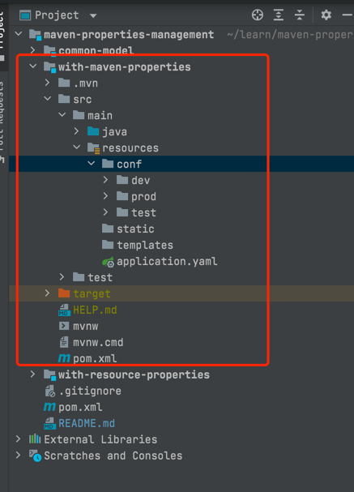

# SpringBoot + Maven properties Management

## 项目目录



## Maven多环境配置

```xml

<profiles>
    <profile>
        <id>dev</id>
        <activation>
            <activeByDefault>true</activeByDefault>
        </activation>
        <properties>
            <profiles.active>dev</profiles.active>
        </properties>
    </profile>
    <profile>
        <id>test</id>
        <properties>
            <profiles.active>test</profiles.active>
        </properties>
    </profile>
    <profile>
        <id>prod</id>
        <properties>
            <profiles.active>prod</profiles.active>
        </properties>
    </profile>
</profiles>
 ```

## Maven `Filters` 配置

**基础属性配置, 配置后响应的文件中的字段会转化为 Maven Properties**

```xml

<!-- java properties 转化为 maven properties -->
<filters>
    <filter>src/main/resources/conf/${profiles.active}/test.properties</filter>
    <filter>src/main/resources/conf/${profiles.active}/test2.properties</filter>
</filters>
```

**根据项目实际情况配置**

## Maven `Resources` 配置

** 开启 `filtering` 默认为 `false`

```xml

<resources>
    <resource>
        <directory>src/main/resources</directory>
        <!-- 开启 filter -->
        <filtering>true</filtering>
    </resource>
</resources>
```

## `application.yaml(.properties)` 配置

```yaml
server:
  port: 9001
  servlet:
    context-path: /with-maven

spring:
  profiles:
    active: @profiles.active@

# admin properties
sys:
  admin:
    id: ${admin.id} # 可以使用${}但是需要注意引入的字段名不能跟yaml(properties)中冲突
    name: @admin.name@ # 标准的引用maven properties属性引用
    age: @admin.age@
    address: @admin.address@
```